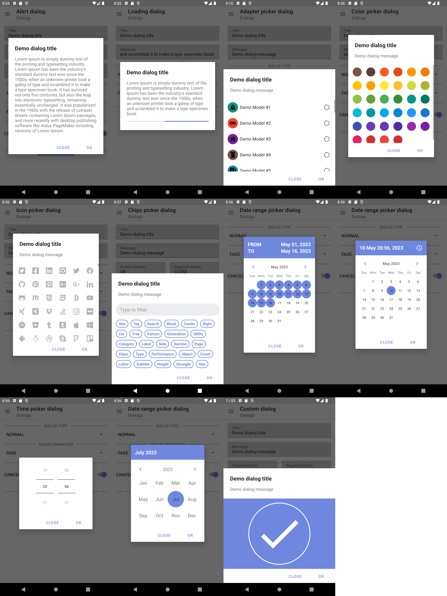

# 💡 Lightbulb-Dialogs

[](https://jitpack.io/#rooneyandshadows/lightbulb-dialogs)

Our Android library provides a flexible and user-friendly approach for creating dialog windows. With
a wide range of customizable attributes, users can easily design dynamic and visually appealing
dialogue windows for their applications. Our library includes pre-built templates for common dialog
types, such as alerts, confirmations, pickers, and input prompts, as well as the ability to create
custom
dialogues using a variety of styling options. Overall, this library is an essential tool that helps
you to create engaging and functional applications with little effort.

-------

### 📋 Features

1. **Configuration change state handling.**
2. Different dialog layout types support: Regular, Fullscreen, BottomSheet.
3. Different show/hide animations support.
4. Width/height Constraints support.
5. **Custom dialog** - Gives you the ability to implement your unique dialog if the existing ones
  does not meet your requirements.
6. **Adapter picker dialog** - Gives you the ability to implement picker dialog using recycler
  adapter without the need to write the heavy selection logic... It's already there :)
- Predefined implementations
7. **Alert dialog** - Dialog that shows a title, message and set of buttons to interact with the
  user.
8. **Loading dialog** - Provides a user-friendly way to indicate to the user that the application
  is working on a task and needs a moment to complete the action.
9. **Picker dialogs** - Set of dialogs that allow the user to choose between different values.
- **Chips picker dialog** - Picker dialog showing available options in Material chips.
- **Color picker dialog** - Gives you the ability to pick colors from predefined set.
- **Icon picker dialog** - Gives you the ability to pick icons from predefined set.
- **Date range picker dialog** - Gives you the ability to pick date range.
- **Date&Time picker dialog** - Gives you the ability to pick date with time.
- **Time picker dialog** - Gives you the ability to pick time.
- **Month picker dialog** - Gives you the ability to pick month of year.

-------

## 🎨 Screenshots



## Latest releases 🛠

- Kotlin
  | [v2.0.3](https://github.com/RooneyAndShadows/lightbulb-dialogs/tree/2.0.3)

# Setup

### 1. Add Jitpack repository to your project

```
repositories {
    ...
    maven {
        url 'https://jitpack.io'
    }
}
```

### 2. Provide the gradle dependency

```gradle
implementation 'com.github.rooneyandshadows:lightbulb-dialogs:2.0.3'
```

### 3. General usage

```Kotlin
class DemoFragment : Fragment() {
    private lateinit var myDialog: MyDialog

    companion object {
        private const val DIALOG_TAG = "MY_DIALOG_TAG"
        private const val DIALOG_STATE_TAG = "MY_DIALOG_STATE_TAG"
    }

    @Override
    override fun onCreate(savedInstanceState: Bundle?) {
        super.onCreate(savedInstanceState)
        var dialogSavedState: Bundle? = null
        savedInstanceState?.apply {
            dialogSavedState = BundleUtils.getParcelable(DIALOG_STATE_TAG, this, Bundle::class.java)
        }
        createDialog(dialogSavedState)
    }

    @Override
    override fun onSaveInstanceState(outState: Bundle) {
        super.onSaveInstanceState(outState)
        val dialogState = myDialog.saveDialogState()
        BundleUtils.putParcelable(DIALOG_STATE_TAG, outState, dialogState)
    }

    private fun createDialog(dialogSavedState: Bundle?) {
        myDialog = MyDialogBuilder(this, childFragmentManager, DIALOG_TAG).apply {
            //Setup the dialog
        }.buildDialog()
    }
}
```

#### AdapterPickerDialog example

#### Note

> Create your adapter

```kotlin
class DemoSingleSelectionDialog : AdapterPickerDialog<DemoModel>() {
    override val adapter: DialogPickerAdapter<DemoModel>
        get() = super.adapter as DialogPickerRadioButtonAdapter<DemoModel>
    override val adapterCreator: AdapterCreator<DemoModel>
        get() = object : AdapterCreator<DemoModel> {
            @Override
            override fun createAdapter(): DialogPickerRadioButtonAdapter<DemoModel> {
                return object : DialogPickerRadioButtonAdapter<DemoModel>() {
                    @Override
                    override fun getItemIcon(context: Context, item: DemoModel): Drawable {
                        return AppIconUtils.getIconWithAttributeColor(
                            context,
                            item.icon,
                            R.attr.colorOnSurface,
                            R.dimen.ICON_SIZE_RECYCLER_ITEM
                        )
                    }

                    @Override
                    override fun getItemIconBackground(
                        context: Context,
                        item: DemoModel
                    ): Drawable {
                        return DrawableUtils.getRoundedCornersDrawable(
                            item.iconBackgroundColor.color,
                            ResourceUtils.dpToPx(100)
                        )
                    }
                }
            }
        }

    companion object {
        fun newInstance(): DemoSingleSelectionDialog {
            return DemoSingleSelectionDialog()
        }
    }
}
```

#### Note

> Create your adapter picker dialog

```kotlin
adapterPickerDialog = AdapterPickerDialogBuilder(
    this,
    childFragmentManager,
    DIALOG_TAG,
    object : AdapterPickerDialogInitializer<DemoSingleSelectionDialog> {
        @Override
        override fun initialize(): DemoSingleSelectionDialog {
            return DemoSingleSelectionDialog.newInstance()
        }
    }
).apply {
    withInitialDialogState(dialogSavedState)
    withTitle(title)
    withMessage(message)
    withPositiveButton(DialogButtonConfiguration(positiveText), onPositiveButtonClick)
    withNegativeButton(DialogButtonConfiguration(negativeText), onNegativeButtonClick)
    withSelectionCallback(selectionCallback)
}.buildDialog()
```

#### AlertDialog example

```kotlin
alertDialog = AlertDialogBuilder(this, childFragmentManager, DIALOG_TAG).apply {
    withInitialDialogState(dialogSavedState)
    withTitle(title)
    withMessage(message)
    withPositiveButton(DialogButtonConfiguration(positiveButtonText), positiveButtonClickListener)
    withNegativeButton(DialogButtonConfiguration(negativeButtonText), negativeButtonClickListener)
}.buildDialog()
```

#### LoadingDialog example

```kotlin
loadingDialog = LoadingDialogBuilder(this, childFragmentManager, DIALOG_TAG).apply {
    val onShowListener = object : DialogShowListener {
        override fun doOnShow(dialogFragment: BaseDialogFragment) {
            requireView().postDelayed({
                dialogFragment.dismiss()
                val toastMessage = ResourceUtils.getPhrase(ctx, R.string.demo_action_completed_text)
                InteractionUtils.showMessage(ctx, toastMessage)
            }, 3000)
        }
    }
    withInitialDialogState(dialogSavedState)
    withTitle(title)
    withMessage(message)
    withOnShowListener(onShowListener)
}.buildDialog()
```

#### ChipsPickerDialog example

```kotlin
chipsPickerDialog = ChipsPickerDialogBuilder(this, childFragmentManager, DIALOG_TAG).apply {
    withInitialDialogState(dialogSavedState)
    withTitle(title)
    withMessage(message)
    withPositiveButton(DialogButtonConfiguration(positiveButtonText), positiveButtonClickListener)
    withNegativeButton(DialogButtonConfiguration(negativeButtonText), negativeButtonClickListener)
    withSelectionCallback(onSelectionChanged)
}.buildDialog()
```

#### ColorPickerDialog example

```kotlin
colorPickerDialog = ColorPickerDialogBuilder(this, childFragmentManager, DIALOG_TAG).apply {
    withInitialDialogState(dialogSavedState)
    withTitle(title)
    withMessage(message)
    withPositiveButton(DialogButtonConfiguration(positiveButtonText), positiveButtonClickListener)
    withNegativeButton(DialogButtonConfiguration(negativeButtonText), negativeButtonClickListener)
    withSelectionCallback(onSelectionChanged)
}.buildDialog()
```

#### IconPickerDialog example

```kotlin
iconPickerDialog = IconPickerDialogBuilder(this, childFragmentManager, DIALOG_TAG).apply {
    withInitialDialogState(dialogSavedState)
    withTitle(title)
    withMessage(message)
    withPositiveButton(DialogButtonConfiguration(positiveButtonText), positiveButtonClickListener)
    withNegativeButton(DialogButtonConfiguration(negativeButtonText), negativeButtonClickListener)
    withSelectionCallback(onSelectionChanged)
}.buildDialog()
```

#### DateRangePickerDialog example

```kotlin
dateRangePickerDialog = DateRangePickerDialogBuilder(this, childFragmentManager, DIALOG_TAG).apply {
    withInitialDialogState(dialogSavedState)
    withPositiveButton(DialogButtonConfiguration(positiveButtonText), positiveButtonClickListener)
    withNegativeButton(DialogButtonConfiguration(negativeButtonText), negativeButtonClickListener)
    withOnDateSelectedEvent(onSelectionChanged)
}.buildDialog()
```

#### DateTimePickerDialog example

```kotlin
dateTimePickerDialog = DateTimePickerDialogBuilder(this, childFragmentManager, DIALOG_TAG).apply {
    withInitialDialogState(dialogSavedState)
    withPositiveButton(DialogButtonConfiguration(positiveButtonText), positiveButtonClickListener)
    withNegativeButton(DialogButtonConfiguration(negativeButtonText), negativeButtonClickListener)
    withOnDateSelectedEvent(onSelectionChanged)
}.buildDialog()
```

#### TimePickerDialog example

```kotlin
timePickerDialog = TimePickerDialogBuilder(this, childFragmentManager, DIALOG_TAG).apply {
    withInitialDialogState(dialogSavedState)
    withPositiveButton(DialogButtonConfiguration(positiveButtonText), positiveButtonClickListener)
    withNegativeButton(DialogButtonConfiguration(negativeButtonText), negativeButtonClickListener)
    withOnDateSelectedEvent(onSelectionChanged)
}.buildDialog()
```

#### MonthPickerDialog example

```kotlin
monthPickerDialog = MonthPickerDialogBuilder(this, childFragmentManager, DIALOG_TAG).apply {
    withInitialDialogState(dialogSavedState)
    withPositiveButton(DialogButtonConfiguration(positiveButtonText), positiveButtonClickListener)
    withNegativeButton(DialogButtonConfiguration(negativeButtonText), negativeButtonClickListener)
    withOnDateSelectedEvent(onSelectionChanged)
}.buildDialog()
```

**More detailed demonstrations you can find in the demo application.**